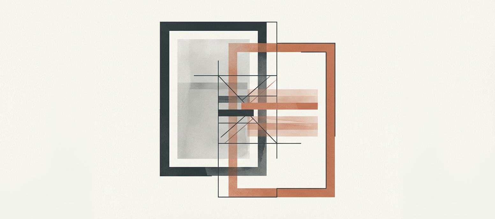

  

<h1 align="center">
  
  Version History Diff
</h1>

  <strong>Compare and restore file versions from Sync, File Recovery, and Git</strong> 
  Obsidian Plugin

  <a href="#features">Features</a> •
  <a href="#installation">Installation</a> •
  <a href="#usage">Usage</a> •
  <a href="#screenshots">Screenshots</a> •
  <a href="#credits">Credits</a>

---

> **Note:** This plugin uses private Obsidian APIs and may break with updates. Use at your own risk.

## Features

- **Multi-source diff** — View version history from Obsidian Sync, File Recovery, or Git
- **Side-by-side comparison** — Choose between line-by-line or side-by-side view
- **Version preview** — Render any version as markdown or plain text before restoring
- **One-click restore** — Overwrite current file with any previous version
- **In-modal switching** — Switch between Sync/Recovery/Git without closing the modal
- **Colour-blind mode** — Accessible diff highlighting
- **Keyboard navigation** — Arrow keys to navigate versions
- **Context menu** — Right-click to copy content, dates, commit hashes, or save patches

## Installation

### From Obsidian Community Plugins

1. Open **Settings** → **Community plugins** → **Browse**
2. Search for "Version History Diff"
3. Click **Install**, then **Enable**

### Manual Installation

1. Download the latest release from [GitHub Releases](https://github.com/kometenstaub/obsidian-version-history-diff/releases)
2. Extract to your vault's `.obsidian/plugins/` folder
3. Enable the plugin in Settings → Community plugins

## Usage

Open the command palette (`Cmd/Ctrl + P`) and search for:
- **Version history diff: Show Sync diff view**
- **Version history diff: Show File Recovery diff view**
- **Version history diff: Show Git diff view**

Or right-click any file → **Version history diff** → Choose source

### Tips

| Feature | Description |
|---------|-------------|
| Two columns | Left = older version, Right = newer version |
| Copy hash | Click git hash to copy (Shift+click for full hash) |
| Arrow keys | Navigate versions with ↑↓, switch columns with ←→ |
| Right-click | Context menu for copy/save options |

For Git integration, install the [Obsidian Git](https://obsidian.md/plugins?id=obsidian-git) plugin.

## Screenshots

### Sync Diff View

### Version Preview

### Git Diff with Colour-blind Mode

## Settings

| Setting | Options | Description |
|---------|---------|-------------|
| Diff style | Word / Character | Granularity of diff highlighting |
| Output format | Line-by-line / Side-by-side | Layout mode (side-by-side for larger screens) |
| Match threshold | 0-1 | Similarity threshold for word matching |
| Colour blindness | On/Off | Alternative colour scheme for accessibility |

## Contributing

Please open an issue before submitting a PR.

## Credits

- [@SlRvb](https://github.com/SlRvb) — CSS adaptation and colour-blind mode
- [@Vinzent03](https://github.com/Vinzent03) — Obsidian Git API integration

### Dependencies

- [diff](https://github.com/kpdecker/jsdiff) — Generate unified diffs
- [diff2html](https://github.com/rtfpessoa/diff2html) — Render diffs as HTML

Full license attributions are in [`esbuild.mjs`](esbuild.mjs) and [`src/styles.scss`](src/styles.scss).

## License

MIT
